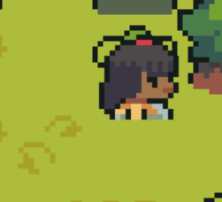
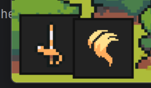

# 基于PyGame的纯Python RPG游戏

***用处:~~完成我的Python课程作业~~***

**项目地址:[github](https://github.com/siyio/Normal_RPG)**

**使用库:**

    pygame,sys

### 参考项目&部分素材
> [[YouTube](https://youtu.be/QU1pPzEGrqw)] | [[GitHub](https://github.com/clear-code-projects/Zelda)] [Creating a Zelda style game in Python [with some Dark Souls elements]]
---
**使用方法:**
安装依赖库,运行src/main.py

**游戏操作:**

    使用 ↑ ↓ ← → 控制移动

    使用 <空格> 攻击

    按下 <CTRL> 使用魔法

    
    按下 <Q> 切换武器
    按下 <E> 切换魔法

    按下 <M> 打开菜单 
*(本来是这样的,但是好像有BUG 不会显示菜单并且无法操作 按下ESC解决)*

**彩蛋:每次启动游戏会触发不同的背景音乐**~~(来自宝可梦朱紫对战曲)~~